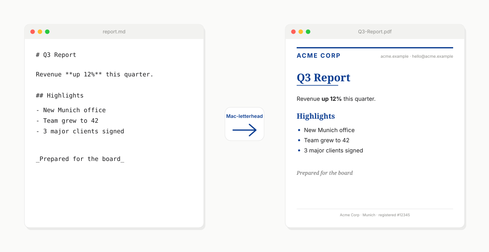

# Mac-letterhead

<!-- mcp-name: io.github.easytocloud/mac-letterhead -->

[](https://pypi.org/project/Mac-letterhead/)
[](https://github.com/easytocloud/homebrew-tap)
[](https://pypi.org/project/Mac-letterhead/)

[](https://github.com/easytocloud/Mac-letterhead/actions/workflows/publish.yml)
[](LICENSE)
[](https://registry.modelcontextprotocol.io)
[](https://pypi.org/project/Mac-letterhead/)

<a href="https://pypi.org/project/Mac-letterhead/" title="Mac-letterhead on PyPI">
  
</a>

**Turn any Markdown file into a professionally-branded PDF on your company's letterhead — with no manual formatting.** Mac-letterhead treats your letterhead PDF as *digital stationery*: it prints your Markdown into the safe area of the page (never overlapping your header, footer, or logo) and applies your brand's typography from a small CSS file.

Runs entirely on your Mac. Same engine as a drag-and-drop droplet, a command-line tool, or a Model Context Protocol server that Claude and other AI clients can call directly.



---

- [What it does](#what-it-does)
- [Install](#install)
- [Quick start (2 minutes)](#quick-start-2-minutes)
- [Use it](#use-it) — [droplet](#-drag-and-drop-droplet) · [CLI](#-command-line) · [MCP server](#-mcp-server-for-ai-clients)
- [Configure & fine-tune](#configure--fine-tune) — [brand CSS](#brand-your-typography-with-css) · [blend strategies](#choose-a-blend-strategy) · [multi-page](#multi-page-letterheads)
- [Advanced](#advanced) · [Privacy](#privacy) · [License](#license)

## What it does

You have a company letterhead — a PDF with your logo at the top, contact info at the bottom, maybe a subtle watermark. You have documents to write, and they need to be on that letterhead: proposals, reports, invoices, memos.

The traditional options are all painful: Word templates that never quite line up, copy-paste-adjust cycles into a designer's InDesign file, or manually placing text over the letterhead in a PDF editor. Or just giving up and sending unbranded.

Mac-letterhead does the whole thing automatically. It **analyzes your letterhead PDF to find the safe printable area** (the space around the header, footer, and logo), **renders your Markdown into that area** with your brand's typography (fonts and colors from a tiny CSS file), and hands you a finished PDF. Multi-page letterhead? First-page vs subsequent pages? Handled.

The same tool ships as three interfaces — a Mac drag-and-drop app (for you), a command-line utility (for scripting), and an MCP server (so Claude and other AI clients can produce your branded documents on request).

## Install

Pick one:

**Homebrew (recommended for everyday Mac use):**
```bash
brew tap easytocloud/tap
brew install mac-letterhead
```

**uvx (no permanent install; uses uv's ephemeral env):**
```bash
uvx mac-letterhead --help
```

**Claude Desktop (double-click install):**
Download the latest `mac-letterhead-<version>.mcpb` from the [releases page](https://github.com/easytocloud/Mac-letterhead/releases) and double-click it — Claude for macOS handles the rest.

### System dependencies (optional but recommended)

For the best rendering quality (full CSS support via WeasyPrint), install the WeasyPrint system libraries once:

```bash
brew install pango cairo fontconfig freetype harfbuzz
```

Without them, Mac-letterhead falls back to ReportLab automatically — simpler output, no external deps, everything still works.

## Quick start (2 minutes)

1. **Put your letterhead somewhere Mac-letterhead can find it.** The default convention is `~/.letterhead/<name>.pdf`:
   ```bash
   mkdir -p ~/.letterhead
   cp /path/to/your-letterhead.pdf ~/.letterhead/company.pdf
   ```

2. **(Optional, but strongly recommended) Add typography.** Create `~/.letterhead/company.css` with your brand's fonts and colors:
   ```css
   body        { font-family: "Inter", "Helvetica Neue", sans-serif; color: #1f2937; }
   h1, h2, h3  { color: #0b3d91; font-family: "Merriweather", Georgia, serif; }
   h1          { border-bottom: 2px solid #0b3d91; padding-bottom: 0.25em; }
   a           { color: #0b3d91; }
   ```
   Skip this and Mac-letterhead uses a clean default.

3. **Create the droplet on your Desktop:**
   ```bash
   mac-letterhead install --name "company"
   ```
   A `company.app` appears on your Desktop.

4. **Drop any `.md` or `.pdf` file onto the droplet.** Choose where to save. You get a letterheaded PDF.

That's it. Every subsequent document is one drop.

## Use it

Same engine, three interfaces.

### 🖱️ Drag-and-drop droplet

Best for human workflows on a Mac. One-time setup, then every future document is a drag onto a Desktop icon.

```bash
mac-letterhead install --name "company"        # uses ~/.letterhead/company.{pdf,css}
mac-letterhead install --name "personal"       # a second droplet for personal docs
mac-letterhead install --name "client-acme"    # one droplet per client / brand
```

Each droplet is a full macOS `.app` bundle you can drag around, put in the Dock, or Automator-chain. Dropping a file on it opens a save dialog for the output location.

### ⌨️ Command line

Best for scripting, CI, or one-shot conversions. No droplet needed.

```bash
# Markdown → letterheaded PDF
mac-letterhead merge-md ~/.letterhead/company.pdf "Q3 Report" ~/Desktop report.md

# Existing PDF → letterheaded PDF
mac-letterhead merge ~/.letterhead/company.pdf "Contract" ~/Desktop contract.pdf

# Preview the safe area (cut marks + tint) as a PDF
mac-letterhead preview ~/.letterhead/company.pdf
```

Full reference: `mac-letterhead --help`.

### 🤖 MCP server for AI clients

Best when you want Claude, Claude Code, Cursor, Windsurf, or another AI assistant to produce branded documents on demand.

Add to your Claude Desktop config (`~/Library/Application Support/Claude/claude_desktop_config.json`):

```json
{
  "mcpServers": {
    "letterhead": {
      "command": "uvx",
      "args": ["mac-letterhead[mcp]", "mcp"]
    }
  }
}
```

Then in Claude: *"Draft a Q3 investor update on our company letterhead."* Mac-letterhead handles the formatting; the PDF lands in `~/Desktop`.

Published on the [official MCP Registry](https://registry.modelcontextprotocol.io) as `io.github.easytocloud/mac-letterhead` — visible on [Glama](https://glama.ai/mcp/servers/easytocloud/mac-letterhead) and [PulseMCP](https://www.pulsemcp.com/servers/easytocloud). For full MCP configuration (style-specific servers, multiple brands from one client), see [README_MCP.md](README_MCP.md).

## Configure & fine-tune

### Preview and mark the safe area

Mac-letterhead needs to know where on your letterhead is *safe* to print content — the space between the header, footer, and any logos. It figures this out in three tiers:

1. **You mark it explicitly.** Open your letterhead in Preview.app, use Markup → Rectangle to draw a box over the intended safe area, click the shape → sidebar → Description → type `safe-area` (or `printable-area` — case-insensitive; substring match). Save. Mac-letterhead treats your rectangle as exact intent.
2. **Auto-detected.** No annotation → Mac-letterhead analyses the letterhead's layout (text, drawings, logos) and derives a safe rectangle that avoids them, with a ~40 pt safety pad.
3. **Fallback default.** No content detected → 1-inch margins on every side.

Preview the resolution any time:

```bash
mac-letterhead preview ~/.letterhead/company.pdf
# writes ~/.letterhead/company-preview.pdf
```

Colour code in the preview PDF — glance to see how confident the tool is:

| Colour | Source | What it means |
|---|---|---|
| **Green** | `annotation` | You marked it. Trusted verbatim. |
| **Slate blue** | `auto-detected` | Heuristic derived it from the letterhead layout. |
| **Amber** | `fallback default` | No content detected. Consider marking it. |

Cut marks at each corner give print-native precision; a very subtle tint fills the region for gestalt. A tiny label at the bottom-left tells you which source drove the result and the safe area's exact dimensions.

### Brand your typography with CSS

The letterhead PDF supplies the visual identity (logo, header, footer). CSS supplies the *typography*: fonts, colors, spacing, table styling, heading treatment. Together they make one reusable brand identity that any Markdown document can be rendered through.

Full example — `~/.letterhead/company.css`:

```css
body        { font-family: "Inter", "Helvetica Neue", sans-serif; color: #1f2937; }
h1, h2, h3  { color: #0b3d91; font-family: "Merriweather", Georgia, serif; }
h1          { border-bottom: 2px solid #0b3d91; padding-bottom: 0.25em; }
a           { color: #0b3d91; text-decoration: underline; }
code, pre   { font-family: "JetBrains Mono", ui-monospace, monospace; background: #f5f7fa; }
table th    { background: #0b3d91; color: white; }
table td    { border-bottom: 1px solid #e5e7eb; }
blockquote  { border-left: 3px solid #0b3d91; color: #4b5563; }
```

CSS is applied inside the safe area, so branded typography stays clear of your header, footer, and logo automatically. (CSS is applied by the WeasyPrint backend; the ReportLab fallback supports a reduced subset.)

### Choose a blend strategy

Different letterheads need different overlay modes. Set with `--strategy` in the CLI, or when creating a droplet.

| Strategy           | Best for                                    |
| ------------------ | ------------------------------------------- |
| `darken` (default) | Dark logo/artwork on light letterhead paper |
| `multiply`         | Watermark-like effects on subtle designs    |
| `overlay`          | Better visibility across mixed contrasts    |
| `transparency`     | Smooth blending with translucent layers     |
| `reverse`          | Letterhead on top, content beneath          |

### Multi-page letterheads

Different letterhead template per page position:

| Letterhead PDF has… | Applied to                                           |
| ------------------- | ---------------------------------------------------- |
| 1 page              | Every document page                                  |
| 2 pages             | Page 1 → first document page; page 2 → all others    |
| 3 pages             | Page 1 → first; page 2 → even; page 3 → odd          |

## Advanced

- **Rendering backends.** [WeasyPrint](https://weasyprint.org/) (preferred, full CSS support) with a [ReportLab](https://www.reportlab.com/) fallback. Install `brew install pango cairo fontconfig freetype harfbuzz` to opt into WeasyPrint.
- **GitHub Flavored Markdown.** Tables, task lists, strikethrough, code blocks with syntax highlighting — all supported when `pycmarkgfm` is available (it's a default dependency).
- **Custom overrides.** `mac-letterhead install --name X --letterhead /some/other.pdf --css /some/other.css` for one-off droplets with non-conventional paths.
- **Publishing / release pipeline.** Contributor-facing: [`docs/publishing.md`](docs/publishing.md).
- **Operator guide.** For contributors: [`CLAUDE.md`](CLAUDE.md) documents the architecture, release rules, and MCP registry constraints.

## Privacy

Mac-letterhead runs entirely on your local machine. No network calls, no telemetry, no analytics, no cloud sync. See [PRIVACY.md](PRIVACY.md).

## Contributing

See [CONTRIBUTING.md](CONTRIBUTING.md).

## License

MIT.
